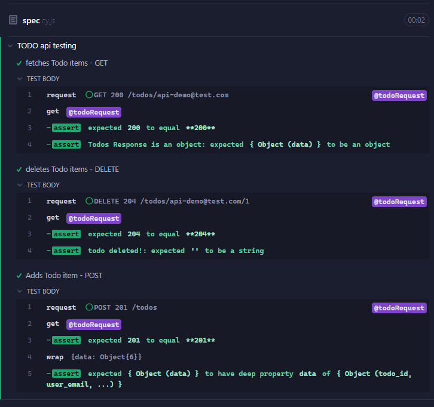
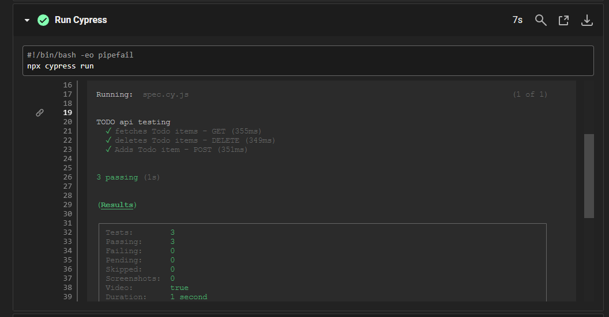

# Todo App Server

This is an API built with Express, and using Knex to connect to a PostgreSQL database.

### Starting Server

---

Clone App: `git clone https://github.com/cheyroseflammer/progressTodoServer.git`

Install dependencies: `npm install`

Create Database: `psql -U postgres ` => `CREATE DATABASE todosDatabase;`

Run Migration Files: `npx knex migrate:latest`

Seed Database: `npx knex seed: run`

Tests: `npm test`

Start server: `npm start`

Start nodemon for development: `npm run dev`

### Testing

Testing done with Cypress on production API endpoint.

Cypress was used to test the todos route and its GET, DELETE, AND POST methods.



### CD/CD

Continuous Integration and Delivery was achieved using CircleCi


Tests being run with CI/CD



### API Endpoint Overview

GET `/todos/:userEmail`

```js
{
  todo_id: Integer,
  user_email: String,
  title: String,
  description: String,
  date: String,
  completed: Boolean
}
```

POST `/todos`

```js
{
  title: String,
  description: String,
}

```

PUT `/todos/:userEmail/:todoId`

```js
{
  todo_id: Integer,
  user_email: String,
  title: String,
  description: String,
  date: String,
  completed: Boolean
}

```

DELETE `/todos/:userEmail/:todoId`

```js
{
  todo_id: Integer,
  user_email: String,
  title: String,
  description: String,
  date: String,
  completed: Boolean
}

```
